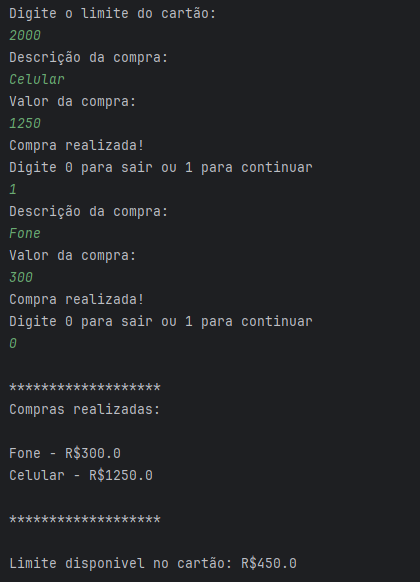

# Aplicação de compras em Java.

## 🔖 Sobre:
Projeto de um programa em java que simula uma Aplicação de compras, no qual utilizo da API de Java "java.util" e métodos como While e Scanner.

## 🚀 Tecnologias:

  

## 📷 Imagens do projeto

    

